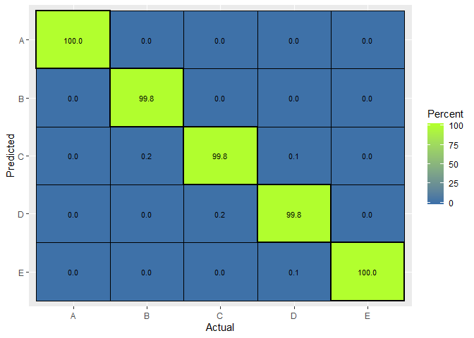

## Task:
* The goal of your project is to predict the manner in which they did the exercise. 
* This is the "classe" variable in the training set. You may use any of the other variables to predict with. 
* You should create a report describing how you built your model, 
* how you used cross validation, 
* what you think the expected out of sample error is, and 
* why you made the choices you did. 
* You will also use your prediction model to predict 20 different test cases.


## Data loading


```r
if(!file.exists("./data")) {
     dir.create("./data")
}
if (!file.exists("./data/training.csv") |
    !file.exists("./data/testing.csv")) {
     fileUrl1 <- "https://d396qusza40orc.cloudfront.net/predmachlearn/pml-training.csv"
     fileUrl2 <- "https://d396qusza40orc.cloudfront.net/predmachlearn/pml-testing.csv"
     download.file(fileUrl1, destfile = "./data/training.csv")
     download.file(fileUrl2, destfile = "./data/testing.csv")
}

data <- read.csv("./data/training.csv")
quiz <- read.csv("./data/testing.csv")
```
## Train and test partition creation and NA handling

Some columns are full of NAs and are NA in the final 12 values, so I mark and remove them from the validation, and build dataset. Then i partition build dataset (original train csv) into train and test parts.


```r
library(caret)
```

```
## Warning: package 'caret' was built under R version 3.6.2
```

```
## Loading required package: lattice
```

```
## Loading required package: ggplot2
```

```r
# ## temp
# shortenbuild <- createDataPartition(y=data$classe, p=0.1, list = FALSE)
# data <- data[shortenbuild,]
# ## temp

allmissing <- sapply(quiz, function(x)!all(is.na(x)))
data[is.na(data)] <- 0
quiz[is.na(quiz)] <- 0
data <- data[,allmissing]
quiz <- quiz[,allmissing]

data <- data[,-1] 
quiz <- quiz[,-1] 


inBuild <- createDataPartition(y = data$classe,
                               p = 0.7, list = FALSE)
validation <- data[-inBuild, ]
buildData <- data[inBuild, ]

inTrain <- createDataPartition(y = buildData$classe,
                               p = 0.7, list = FALSE)
training <- buildData[inTrain, ]
testing <- buildData[-inTrain, ]
dim(training)
```

```
## [1] 9619   59
```

```r
dim(testing)
```

```
## [1] 4118   59
```

```r
dim(validation)
```

```
## [1] 5885   59
```
#### rational for choices and cross-validation
In a differetn model, i tried leaving all variables, but it a) increased run time significantly, b) was overly reliant on the variable X present in the training dataset. So I chose to exlude variable "X".

Additional clarification - as the dataset was rather large, i split training data into 3 part:

1. Validation (0.3 of the initial dataset)
2. Training (0.49 of the initial dataset)
3. Testin (0.21 of the initial dataset)

This alloed us to use training and testing multiple times, only comparing the model once on the Validation set before predicting the test 20 samples for the test.

### build 3 models 

I deliberately chose not to eliminate variables to test how different models perform on an unprocessed dataset.

I chose 4 methods: 
1. Generalized Boosted Model
2. Random forest
3. Linear discriminant analysis
4. Ensemble of the 1-3 above.


```r
set.seed(45)
mod1 <- train(classe~., method ="gbm", data = training, verbose = FALSE)
mod2 <- train(classe~., method ="rf", data = training, trControl = trainControl(method = "cv"),number = 3, verbose = FALSE)
mod3 <- train(classe~., method ="lda", data = training, verbose = FALSE)
```
### compare them

```r
pred1 <- predict(mod1, testing)
pred2 <- predict(mod2, testing)
pred3 <- predict(mod3, testing)
predDF3 <- data.frame(pred1, pred2, pred3, classe = testing$classe)

MLmetrics::Accuracy(pred1,testing$classe)
```

```
## [1] 0.9958718
```

```r
MLmetrics::Accuracy(pred2,testing$classe)
```

```
## [1] 0.998543
```

```r
MLmetrics::Accuracy(pred3,testing$classe)
```

```
## [1] 0.8550267
```

### make a model that combines predictors


```r
combModFit3 <- train(classe~., method = "gbm", data = predDF3, verbose = FALSE)
combPred <- predict(combModFit3,predDF3)
MLmetrics::Accuracy(combPred,testing$classe)
```

```
## [1] 0.998543
```

### on a validation

```r
pred1V <- predict(mod1, validation)
pred2V <- predict(mod2, validation)
pred3V <- predict(mod3, validation)

predVDF <-
    data.frame(
        pred1 = pred1V,
        pred2 = pred2V,
        pred3 = pred3V
    )
combPredV <- predict(combModFit3,predVDF)
MLmetrics::Accuracy(y_pred = pred1V,y_true = validation$classe)
```

```
## [1] 0.9964316
```

```r
MLmetrics::Accuracy(y_pred = pred2V,y_true = validation$classe)
```

```
## [1] 0.9989805
```

```r
MLmetrics::Accuracy(y_pred = pred3V,y_true = validation$classe)
```

```
## [1] 0.8569244
```

```r
## this is a combined model
MLmetrics::Accuracy(y_pred = combPredV,y_true = validation$classe)
```

```
## [1] 0.9989805
```

```r
confusionMatrix(combPredV,validation$classe)
```

```
## Confusion Matrix and Statistics
## 
##           Reference
## Prediction    A    B    C    D    E
##          A 1674    0    0    0    0
##          B    0 1137    0    0    0
##          C    0    2 1024    1    0
##          D    0    0    2  962    0
##          E    0    0    0    1 1082
## 
## Overall Statistics
##                                           
##                Accuracy : 0.999           
##                  95% CI : (0.9978, 0.9996)
##     No Information Rate : 0.2845          
##     P-Value [Acc > NIR] : < 2.2e-16       
##                                           
##                   Kappa : 0.9987          
##                                           
##  Mcnemar's Test P-Value : NA              
## 
## Statistics by Class:
## 
##                      Class: A Class: B Class: C Class: D Class: E
## Sensitivity            1.0000   0.9982   0.9981   0.9979   1.0000
## Specificity            1.0000   1.0000   0.9994   0.9996   0.9998
## Pos Pred Value         1.0000   1.0000   0.9971   0.9979   0.9991
## Neg Pred Value         1.0000   0.9996   0.9996   0.9996   1.0000
## Prevalence             0.2845   0.1935   0.1743   0.1638   0.1839
## Detection Rate         0.2845   0.1932   0.1740   0.1635   0.1839
## Detection Prevalence   0.2845   0.1932   0.1745   0.1638   0.1840
## Balanced Accuracy      1.0000   0.9991   0.9987   0.9988   0.9999
```
We can see that the ensemble model outperforms all three indiviual models, but it is only marginally better than the Generalized Boosted Model.

### Final confution matrix for the validation set

```r
library(jcolors) 
levels = c('A', 'B', 'C', 'D', 'E')
validationresults = data.frame(ordered(validation$classe, levels = levels),
                               ordered(combPredV, levels = levels))


names(validationresults) = c("Actual", "Predicted") 
 
#compute frequency of actual categories
actual = as.data.frame(table(validationresults$Actual))
names(actual) = c("Actual","ActualFreq")
 
#build confusion matrix
confusion = as.data.frame(table(validationresults$Actual, validationresults$Predicted))
names(confusion) = c("Actual","Predicted","Freq")
 
#calculate percentage of test cases based on actual frequency
confusion = merge(confusion, actual, by=c("Actual"))
confusion$Percent = confusion$Freq/confusion$ActualFreq*100
 
#render plot
ggplot(aes(x=Actual, y=ordered(Predicted, levels=rev(levels)),fill=Percent),data=confusion) +
geom_tile( color="black",size=0.1) +
labs(x="Actual",y="Predicted") + 
geom_text(aes( label=sprintf("%.1f", Percent)),data=confusion, size=3, colour="black") +
scale_fill_jcolors_contin(palette = "pal10")+
geom_tile(aes(x=Actual,y=ordered(Predicted, levels=rev(levels))),data=subset(confusion, as.character(Actual)==as.character(Predicted)), color="black",size=1, fill="black", alpha=0) 
```

<!-- -->

### Final results for the quiz


```r
require(knitr)
```

```
## Loading required package: knitr
```

```
## Warning: package 'knitr' was built under R version 3.6.2
```

```r
pred1q <- predict(mod1, quiz)
pred2q <- predict(mod2, quiz)
pred3q <- predict(mod3, quiz)

predq <-
    data.frame(
        pred1 = pred1q,
        pred2 = pred2q,
        pred3 = pred3q
    )
combPredV <- predict(combModFit3,predq)
quizresults = data.frame(1:dim(quiz)[1],combPredV)
names(quizresults) = c("N", "Predicted") 
kable(quizresults)
```


  N  Predicted 
---  ----------
  1  B         
  2  A         
  3  B         
  4  A         
  5  A         
  6  E         
  7  D         
  8  B         
  9  A         
 10  A         
 11  B         
 12  C         
 13  B         
 14  A         
 15  E         
 16  E         
 17  A         
 18  B         
 19  B         
 20  B         

## Conclusions

My approach resulted in above 97% accuracy even when I ran the code on 10% of the provided data due to a slow computer. On the whole dataset, accuracy is 99.9%
Final score for the quiz was 100%
